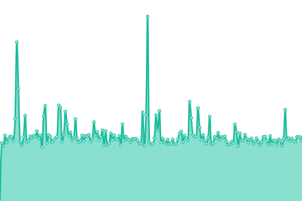

# [📈 Live Status](https://KaratekHD.github.io/status): <!--live status--> **🟩 All systems operational**

This repository contains the open-source uptime monitor and status page for [Karatek_HD](karatek.net), powered by [Upptime](https://github.com/upptime/upptime).

With [Upptime](https://upptime.js.org), you can get your own unlimited and free uptime monitor and status page, powered entirely by a GitHub repository. We use [Issues](https://github.com/KaratekHD/status/issues) as incident reports, [Actions](https://github.com/KaratekHD/status/actions) as uptime monitors, and [Pages](https://KaratekHD.github.io/status) for the status page.

<!--start: status pages-->
<!-- This summary is generated by Upptime (https://github.com/upptime/upptime) -->
<!-- Do not edit this manually, your changes will be overwritten -->
<!-- prettier-ignore -->
| URL | Status | History | Response Time | Uptime |
| --- | ------ | ------- | ------------- | ------ |
|  [Homepage](https://karatek.net) | 🟩 Up | [homepage.yml](https://github.com/KaratekHD/status/commits/HEAD/history/homepage.yml) | 

 197ms
     
 | 

<a href="https://uptime.karatek.systems/history/homepage">100.00%</a>
    

|  IServ | 🟩 Up | [i-serv.yml](https://github.com/KaratekHD/status/commits/HEAD/history/i-serv.yml) | 

 671ms
     
 | 

<a href="https://uptime.karatek.systems/history/i-serv">100.00%</a>
    

|  IServ (for comparison) | 🟩 Up | [i-serv-for-comparison.yml](https://github.com/KaratekHD/status/commits/HEAD/history/i-serv-for-comparison.yml) | 

 542ms
     
 | 

<a href="https://uptime.karatek.systems/history/i-serv-for-comparison">61.98%</a>
    

|  [IServ ViKo bbbha60b2](https://bbbha60b2.videoconference.iserv.eu) | 🟩 Up | [i-serv-vi-ko-bbbha60b2.yml](https://github.com/KaratekHD/status/commits/HEAD/history/i-serv-vi-ko-bbbha60b2.yml) | 

 415ms
     
 | 

<a href="https://uptime.karatek.systems/history/i-serv-vi-ko-bbbha60b2">100.00%</a>
    

<!--end: status pages-->

[**Visit our status website →**](https://KaratekHD.github.io/status)

## 📄 License

- Powered by: [Upptime](https://github.com/upptime/upptime)
- Code: [MIT](./LICENSE) © [Karatek_HD](karatek.net)
- Data in the `./history` directory: [Open Database License](https://opendatacommons.org/licenses/odbl/1-0/)
